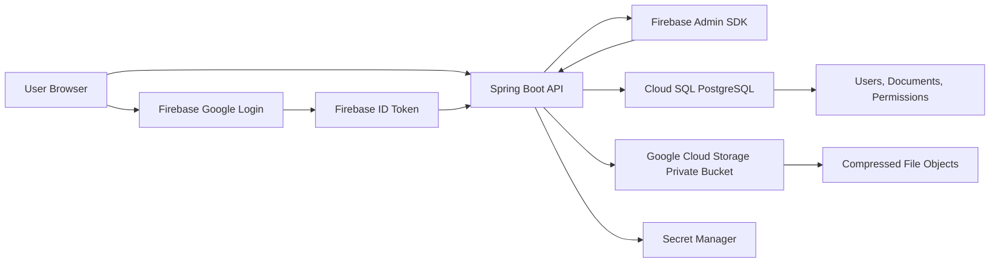
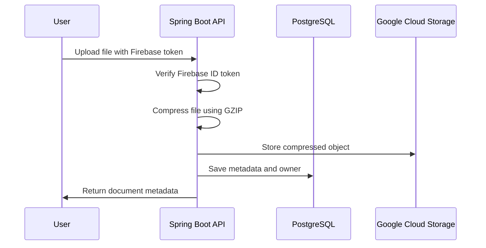
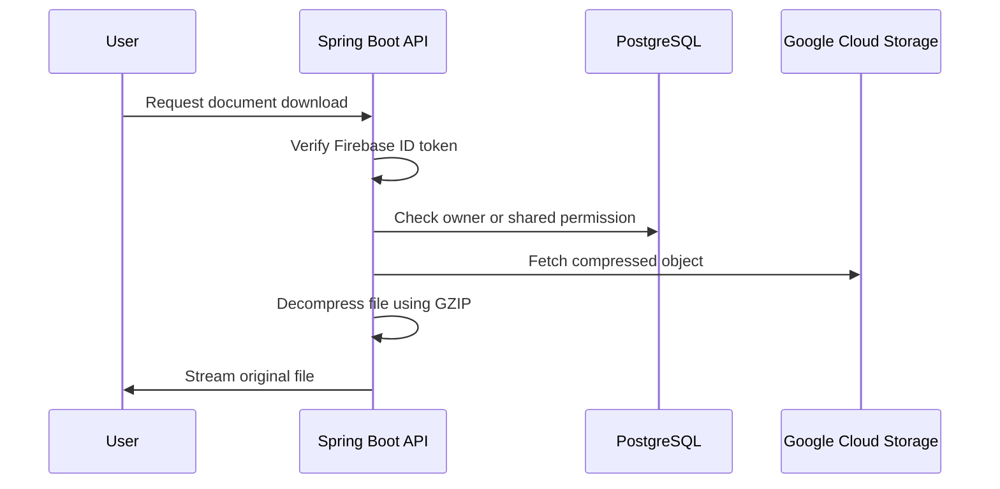

# StratusVault — Secure Cloud File Share

StratusVault is a secure document locker built with **Spring Boot** and **Google Cloud**. It allows users to authenticate with Google, upload documents, compress files losslessly, store them privately in Google Cloud Storage, and share read-only access with other users through an application-level access control system.

This project focuses on **backend security, cloud-native architecture, file storage, authentication, and access control**.

---

## Core Features

- **Google Sign-In Authentication**
  - Users authenticate with Google through Firebase Authentication.
  - Backend verifies Firebase ID tokens before allowing access to protected APIs.

- **Secure File Upload**
  - Authenticated users can upload documents through the backend API.
  - File metadata is stored in PostgreSQL.
  - File objects are stored privately in Google Cloud Storage.

- **Lossless File Compression**
  - Uploaded files are compressed using GZIP before storage.
  - Files are decompressed during download so users receive the original file.

- **Owner-Based File Management**
  - Users can only view and manage files they own.
  - Backend access checks are enforced using the authenticated user's identity.

- **Read-Only File Sharing**
  - File owners can share documents with other registered users.
  - Shared users receive read-only access.
  - Unauthorized users cannot list or download files.

- **Secret Management**
  - Sensitive configuration such as database credentials can be managed using Google Cloud Secret Manager.

---

## Architecture



---

## System Design Overview

StratusVault separates **file metadata** from **file content**.

- PostgreSQL stores users, document metadata, ownership, and sharing permissions.
- Google Cloud Storage stores compressed file objects.
- Firebase Authentication handles user identity.
- Spring Security validates incoming requests using Firebase ID tokens.
- Application-level authorization checks determine whether a user can list, download, or share a document.

This keeps the storage bucket private and prevents direct public access to uploaded files.

---

## Tech Stack

| Layer | Technology |
|---|---|
| Backend | Java 21, Spring Boot |
| Security | Spring Security, Firebase Admin SDK |
| Database | PostgreSQL, Spring Data JPA |
| Cloud Storage | Google Cloud Storage |
| Secrets | Google Cloud Secret Manager |
| Cloud Deployment | Google Cloud Run |
| Build Tool | Maven |
| Compression | Java GZIP streams |

---

## Data Model

### User

Represents an authenticated application user.

| Field | Description |
|---|---|
| `id` | Internal database ID |
| `firebaseUid` | Firebase user ID |
| `email` | User email |
| `displayName` | User display name |

### Document

Represents a file uploaded by a user.

| Field | Description |
|---|---|
| `id` | Document ID |
| `fileName` | Original file name |
| `gcsPath` | Path to compressed object in GCS |
| `originalSize` | Size before compression |
| `compressedSize` | Size after compression |
| `owner` | User who uploaded the document |

### DocumentPermission

Represents shared access to a document.

| Field | Description |
|---|---|
| `id` | Permission ID |
| `document` | Shared document |
| `sharedWithUser` | User receiving access |
| `permissionLevel` | Access level, currently `READER` |

---

## API Overview

| Method | Endpoint | Description | Auth Required |
|---|---|---|---|
| `GET` | `/api/me` | Returns current authenticated user | Yes |
| `POST` | `/api/documents/upload` | Uploads and compresses a file | Yes |
| `GET` | `/api/documents` | Lists owned and shared documents | Yes |
| `GET` | `/api/documents/{id}/download` | Downloads and decompresses a file | Yes |
| `POST` | `/api/documents/{id}/share` | Shares a document with another user | Yes |
| `DELETE` | `/api/documents/{id}` | Deletes an owned document | Yes |

---

## Security Model

Every protected request must include a Firebase ID token:

```http
Authorization: Bearer <firebase-id-token>
```

The backend validates the token using the Firebase Admin SDK.

Access rules:

| Action | Allowed User |
|---|---|
| Upload document | Authenticated user |
| List own files | Document owner |
| List shared files | User with explicit permission |
| Download file | Owner or shared user |
| Share file | Owner only |
| Delete file | Owner only |

The Google Cloud Storage bucket should remain private. Users should never access stored objects directly.

---

## File Upload Flow



---

## File Download Flow



---

## Local Development Setup

### Prerequisites

Install the following:

- Java 21
- Maven
- PostgreSQL
- Google Cloud SDK
- Firebase project with Google Authentication enabled
- Google Cloud project with:
  - Cloud Storage
  - Cloud SQL
  - Secret Manager
  - Cloud Run
  - Artifact Registry

---

## Environment Variables

Create an environment file or configure these values in your IDE:

```env
SPRING_DATASOURCE_URL=jdbc:postgresql://localhost:5432/stratusvault
SPRING_DATASOURCE_USERNAME=postgres
SPRING_DATASOURCE_PASSWORD=your_password

GCP_PROJECT_ID=your-gcp-project-id
GCS_BUCKET_NAME=your-gcs-bucket-name

FIREBASE_PROJECT_ID=your-firebase-project-id
GOOGLE_APPLICATION_CREDENTIALS=/path/to/service-account.json
```

Do not commit real credentials.

---

## Run Locally

Clone the repository:

```bash
git clone https://github.com/OmChauhan9/stratusvault-secure-cloud-file-share.git
cd stratusvault-secure-cloud-file-share
```

Run the application:

```bash
./mvnw spring-boot:run
```

The API will start at:

```txt
http://localhost:8080
```

---

## Build

```bash
./mvnw clean package
```

---

## Docker Build

```bash
docker build -t stratusvault .
docker run -p 8080:8080 stratusvault
```

---

## Google Cloud Deployment

The intended deployment target is **Google Cloud Run**.

High-level deployment flow:

```bash
gcloud auth login
gcloud config set project <PROJECT_ID>

gcloud builds submit --tag gcr.io/<PROJECT_ID>/stratusvault

gcloud run deploy stratusvault \
  --image gcr.io/<PROJECT_ID>/stratusvault \
  --platform managed \
  --region us-central1 \
  --allow-unauthenticated
```

For production, configure:

- Cloud SQL connection
- Service account permissions
- Secret Manager access
- Private GCS bucket permissions
- Required environment variables

---

## Demo Flow

A simple demo can show the complete security and sharing workflow:

1. Log in as User A.
2. Upload a document.
3. Confirm the file is compressed and stored privately.
4. Share the document with User B.
5. Log in as User B.
6. View the shared document.
7. Download the file and verify the original content is restored.
8. Try accessing the file as User C and confirm access is denied.

---

## Engineering Decisions

### Why Firebase Authentication?

Firebase Authentication provides a simple Google Sign-In flow and gives the backend a verifiable ID token. The backend does not trust the frontend directly; it verifies every token server-side.

### Why Google Cloud Storage?

Cloud Storage is a better fit for file objects than storing binary data in PostgreSQL. PostgreSQL stores metadata and permissions, while GCS stores the compressed file content.

### Why PostgreSQL?

PostgreSQL is used for structured relational data such as users, documents, and document permissions. This makes ownership and sharing queries straightforward.

### Why GZIP compression?

GZIP provides lossless compression using Java's built-in libraries. This keeps implementation simple while reducing storage usage for compressible files.

### Why application-level ACLs?

Cloud Storage permissions are kept private and centralized. The application decides who can access each document based on database permissions.

---

## Future Improvements

- Add signed URL support for temporary downloads
- Add file preview support
- Add virus scanning before storing files
- Add audit logs for upload, download, and sharing events
- Add rate limiting for upload and download APIs
- Add folder-based organization
- Add role-based permissions beyond read-only sharing
- Add integration tests for authorization rules
- Add CI/CD pipeline with GitHub Actions
- Add Terraform infrastructure for repeatable GCP deployment

---

## Repository Status

This project is under active development.

Current focus:

- Backend security
- File upload/download workflows
- Cloud storage integration
- Access control and sharing
- Cloud deployment readiness

---

## Author

**Om Chauhan**  
M.S. Software Engineering, Arizona State University

- GitHub: [OmChauhan9](https://github.com/OmChauhan9)
- LinkedIn: [Om Chauhan](https://www.linkedin.com/in/om-chauhan-9a567623b)
- Portfolio: [omchauhan](https://omchauhan9.github.io/)
